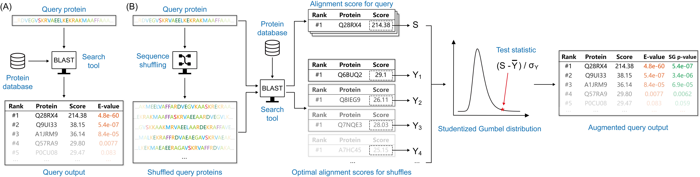

# SGPvalue



Source code for **A BLAST from the past: revisiting blastp’s E-value**

## Demo

Please unzip the `demo_new.tar.gz` file and run the `run_blastp.sh` therein.

## Requirements

Please make sure NCBI Blast is installed so that it can be properly called by our python wrapper.

## **Citation**

Please cite our paper if you fine our data, model or code useful.

```
@article{lu:blast,
  title={{A BLAST from the past: revisiting blastp's E-value}},
  author={Y. Y. Lu and W. S. Noble and U. Keich},
  journal={bioRxiv},
  pages={2024--07},
  year={2024},
  publisher={Cold Spring Harbor Laboratory}
}
```